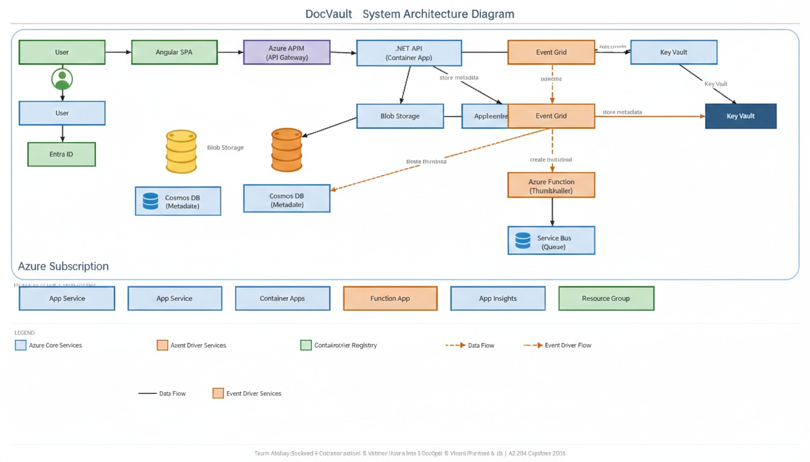

#  DocVault – Secure Document Management Platform

> AZ-204 Capstone Project  
> Built using .NET 8, Angular 17, and Microsoft Azure

---

##  Project Overview

DocVault is a cloud-based secure document management system that allows users to:

- Upload files
- Store documents securely in Azure Blob Storage
- Store metadata in Azure Cosmos DB
- View uploaded documents in a modern Angular UI
- Download files using secure SAS URLs

This project demonstrates real-world Azure integration aligned with the AZ-204 certification objectives.

---

##  Team Members & Roles

###  Akshay – Backend 
- Built .NET 8 Web API
- Implemented file upload endpoint
- Integrated Azure Blob Storage
- Integrated Azure Cosmos DB
- Configured CORS
- Enabled Swagger (OpenAPI)

###  Vaibhav – Azure & DevOps 
- Created Azure Resource Group
- Created Storage Account and Blob Containers
- Created Cosmos DB and SQL container
- Configured Azure App Service
- Implemented GitHub Actions CI/CD
- Configured branch protection rules

###  Vikrant – Frontend 
- Developed Angular 17 application
- Built Upload UI (Drag & Drop)
- Built Document List UI
- Connected Angular to .NET API
- Implemented API service layer

---

##  Architecture

Angular Frontend (Port 4200)  
⬇  
.NET 8 Web API (Port 5251)  
⬇  
Azure Blob Storage (File Storage)  
⬇  
Azure Cosmos DB (Metadata Storage)

---

##  Features Implemented (Day 1)

###  Backend
- Controller-based .NET 8 Web API
- Upload document endpoint
- List documents endpoint
- Health check endpoint
- Secure SAS download URLs
- Dependency Injection setup
- CORS configuration

###  Azure Integration
- Blob container: `uploads`
- Cosmos DB database: `docvault`
- Container: `documents`
- Partition key: `/userId`

###  Frontend
- Drag-and-drop upload
- Angular Material UI
- Document list with file size formatting
- Refresh functionality

###  DevOps
- GitHub repository setup
- Branch protection rules
- Feature branch workflow
- CI/CD using GitHub Actions

---

##  Technologies Used

- .NET 8 Web API
- Angular 17
- Azure Blob Storage
- Azure Cosmos DB (SQL API)
- GitHub Actions
- Swagger (OpenAPI)

---

##  API Endpoints

###  Health Check
GET /api/health

###  Upload Document
POST /api/documents

###  List Documents
GET /api/documents

---

##  Local Development Setup

### 1 Clone Repository
git clone <repository-url>  
cd docvault

---

### 2 Backend Setup

Navigate to backend:

cd api/DocVault.Api

Create local configuration file (DO NOT COMMIT):

appsettings.Development.json

Add:

{
  "StorageConnectionString": "STORAGE_CONNECTION_STRING",
  "CosmosConnectionString": "COSMOS_CONNECTION_STRING"
}

Run backend:

dotnet run

Backend runs at:
http://localhost:5251

Swagger available at:
http://localhost:5251/swagger

---

### 3 Frontend Setup

Navigate to frontend:

cd frontend/docvault-frontend

Update API URL in:
src/environments/environment.ts

apiUrl: 'http://localhost:5251/api'

Run frontend:

ng serve

Frontend runs at:
http://localhost:4200

---

##  Security Notes

- Connection strings are stored in `appsettings.Development.json`
- Sensitive files are excluded using `.gitignore`
- No secrets are committed to GitHub
- Feature branch workflow enforced

---

##  Git Workflow

feature/* → dev → main

Rules:
- Never commit directly to main
- Always create feature branches
- Use Pull Requests before merging

---

##  Testing Flow

1. Start backend
2. Start frontend
3. Open http://localhost:4200
4. Upload file
5. Verify:
   - File appears in list
   - File stored in Azure Blob Storage
   - Metadata stored in Cosmos DB

---

##  Day 1 Goal Achieved

- Secure file upload system  
- Azure storage integration  
- Metadata persistence  
- Angular + .NET integration  
- CI/CD pipeline configured  

---


## Day 1 Conclusion

DocVault demonstrates a real-world full-stack cloud application integrating:

- Modern frontend (Angular)
- Scalable backend (.NET 8)
- Secure Azure storage services
- Professional DevOps workflow

This completes Day 1 of the AZ-204 Capstone Project.

#  DocVault – Day 2 (Security, Identity & Secret Management)

> AZ-204 Capstone Project – Day 2  
> Focus: Authentication, Authorization & Secure Azure Integration

---

##  Day 2 Objective

Enhance DocVault with enterprise-level security by implementing:

- Microsoft Entra ID Authentication
- JWT Token Validation
- User-based Data Isolation
- Azure Key Vault Integration
- Managed Identity (Zero Credential Architecture)
- Secure Search Functionality

---

##  Team Contributions – Day 2

###  Akshay – Backend Security & Identity

Completed:

- Implemented Microsoft Entra ID authentication
- Configured JWT Bearer token validation
- Secured API using `[Authorize]`
- Extracted user identity using `oid` claim
- Implemented user-based data isolation
- Added Search endpoint with Cosmos DB filtering
- Integrated Azure Key Vault
- Implemented Managed Identity authentication
- Removed local development secrets
- Verified CI pipeline success

---

###  Vaibhav – Azure Configuration & Identity Setup

Completed:

- Created Azure App Registration
- Configured API scope:

  ```
  api://cdeae5d3-39ef-4f39-adb4-0dcfcf038a0f/Documents.Read
  ```

- Configured Tenant ID
- Assigned Key Vault access roles
- Created and stored secrets in Azure Key Vault
- Verified role assignments for team members

---

###  Vikrant – Frontend Preparation

Prepared:

- Angular configuration for secure API calls
- Frontend readiness for Entra ID login integration
- API service updates for token-based communication


---

##  Security Features Implemented

### 1 Microsoft Entra ID Authentication

- JWT Bearer authentication enabled
- Token validation using `Microsoft.Identity.Web`
- API secured with `[Authorize]`
- Public health endpoint allowed using `[AllowAnonymous]`

User identity extraction:

```csharp
var userId = User.FindFirst("oid")?.Value;
```

---

### 2 User-Based Document Isolation

Each document is stored with:

```
UserId = JWT oid
```

Cosmos DB partition key:

```
/userId
```

Users can only:

- View their own documents
- Search within their own documents
- Upload under their own identity

---

### 3 Azure Key Vault Integration

Secrets removed from local configuration.

Stored securely in:

```
Azure Key Vault: docvault-kv1234
```

Secrets used:

- StorageConnectionString
- CosmosConnectionString

Program.cs configuration:

```csharp
builder.Configuration.AddAzureKeyVault(
    new Uri(keyVaultUrl),
    new DefaultAzureCredential());
```

---

### 4 Managed Identity (Zero Credential Architecture)

#### Local Development

```
az login --tenant aba96f5c-fedf-45cc-8df8-8a5c26557f1f
```

`DefaultAzureCredential` uses Azure CLI authentication.

#### Production

Azure App Service uses:

```
System Assigned Managed Identity
```

No secrets stored in:

- Code
- Config files
- Environment variables
- GitHub repository

---

##  New Feature – Secure Search Endpoint

Endpoint:

```
GET /api/documents/search?query=test
```

Cosmos DB query:

```sql
SELECT * FROM c 
WHERE c.userId = @userId 
AND CONTAINS(c.fileName, @query)
```

Features:

- Secure (JWT required)
- User-isolated
- Cosmos DB optimized filtering
- CI verified

---

##  Updated API Endpoints (Day 2)

Public:

```
GET /api/health
```

Secure:

```
POST /api/documents
GET /api/documents
GET /api/documents/search
```

---

##  Local Development (Day 2)

1 Login to Azure:

```
az login --tenant aba96f5c-fedf-45cc-8df8-8a5c26557f1f
```

2 Run API:

```
cd api/DocVault.Api
dotnet run
```

Swagger:

```
http://localhost:5251/swagger
```

---

##  Day 2 Goals Achieved

- Microsoft Entra ID authentication  
- JWT validation  
- User-based isolation  
- Azure Key Vault integration  
- Managed Identity implementation  
- Zero credential backend  
- Secure search functionality  
- CI/CD pipeline passing  

---

##  Day 2 Conclusion

Day 2 successfully upgraded DocVault from a basic cloud application to a secure, enterprise-ready Azure solution.

Security, identity management, and secret protection are now implemented according to AZ-204 certification standards.

#  DocVault – Day 3 (Events, Messaging & Observability)

> AZ-204 Capstone Project – Day 3  
> Focus: Event-Driven Architecture, Messaging & Monitoring

---

##  Day 3 Objective

Transform DocVault into a production-grade, event-driven cloud system by implementing:

- Azure Event Grid (Event Publishing)
- Azure Service Bus (Reliable Messaging)
- Azure Function with EventGrid Trigger
- Azure API Management (APIM)
- Rate Limiting & Response Caching
- Application Insights (Custom Telemetry)
- Availability Monitoring
- Angular → APIM Gateway Integration

---

## 👥 Team Contributions – Day 3

###  Akshay – Event Publishing & Observability (Backend)

- Modified Upload API to publish `DocumentUploaded` event
- Integrated Azure Event Grid SDK
- Implemented safe event publishing (non-blocking)
- Added Application Insights custom telemetry
- Tracked upload duration metric
- Tracked custom `DocumentUploaded` event
- Verified Event Grid metrics and Live Metrics stream

---

###  Vaibhav – Azure Messaging & API Management

- Created Azure Event Grid Topic
- Stored Event Grid endpoint and key in Azure Key Vault
- Created Azure Service Bus Namespace
- Created `document-processing` queue with dead-letter support
- Configured Event Subscription to Azure Function
- Created Azure API Management (Consumption Tier)
- Imported OpenAPI specification into APIM
- Configured APIM policies:
  - CORS
  - Rate limiting (10 requests/minute)
  - Response caching (30 seconds)
- Connected Application Insights to App Service and Function App

---

###  Vikrant – Frontend & Monitoring

- Updated Angular to use APIM gateway URL
- Verified rate limiting behavior (429 response)
- Verified cached responses via APIM
- Created Availability Test (health check every 5 minutes)
- Built basic Angular Dashboard (monitoring UI placeholder)

---

#  Architecture (After Day 3)

Angular Frontend  
⬇  
Azure API Management  
⬇  
.NET 8 Web API (App Service)  
⬇  
Publishes Event → Azure Event Grid  
⬇  
Azure Function (EventGridTrigger)  
⬇  
Blob Processing  

Heavy Processing → Azure Service Bus Queue  

Monitoring → Application Insights  
Health Monitoring → Availability Test  

---

#  Event-Driven Architecture Implementation

## 1 Azure Event Grid Integration

### Event Type

---

## 2 Azure Function – EventGrid Trigger

- After publishing the `DocVault.DocumentUploaded` event,  
- the Azure Function is triggered automatically using Event Grid subscription.

### Updated Trigger

### Function Implementation

``csharp
[Function(nameof(ProcessDocument))]
public async Task ProcessDocument(
    [EventGridTrigger] EventGridEvent eventGridEvent)
{
    _logger.LogInformation(
        "Event Grid Triggered: {Subject} | {Type}",
        eventGridEvent.Subject,
        eventGridEvent.EventType);

    var data = eventGridEvent.Data
        .ToObjectFromJson<DocumentUploadedData>();

    var container = _blobClient.GetBlobContainerClient("uploads");
    var blobClient = container.GetBlobClient(data.BlobName);

    using var stream = new MemoryStream();
    await blobClient.DownloadToAsync(stream);

    stream.Position = 0;

    // Thumbnail generation or processing logic
}
---

## Configured Policies

### 1 CORS Policy

Allowed:

- http://localhost:4200  
- Production Angular URL  

---

### 2 Rate Limiting

---

### 3 Response Caching

- Applied to `GET /api/documents`
- Cache duration: 30 seconds  

Second request within 30 seconds:

- Served from APIM cache  
- Faster response time . 

---

#  Application Insights Integration

### Resource


Tracks upload time in milliseconds.

---


### Tracked Properties

- fileName  
- contentType  
- sizeBytes  
- userId  

Visible in:

- Live Metrics  
- Metrics Explorer  
- Custom Events tab  

---

#  Availability Monitoring

### Standard Test Configuration

- URL: `/api/health`  
- Frequency: Every 5 minutes  
- Regions: 3+  
- Success Criteria: HTTP 200  
- Alert enabled if 2+ regions fail  

Ensures global availability monitoring.

---

#  Angular Integration with APIM

### Updated Environment Configuration

``ts
apiBaseUrl: 'https://docvault-apim.azure-api.net/api'

##  New Request Flow

Angular → APIM → API → Event Grid → Function  

### Verified

- Rate limit working  
- Cache working  
- API accessible through gateway  

---

#  Testing Flow (Day 3)

1. Upload file  
2. Check Event Grid metrics → 1 event published  
3. Check Function logs → triggered successfully  
4. Check APIM analytics → request visible  
5. Upload 11 files quickly → 429 error  
6. Call GET twice within 30 seconds → second call cached  
7. Check Live Metrics → custom telemetry visible  
8. Verify Availability test status → Green  

---

#  Day 3 Goals Achieved

- Event-driven architecture implemented  
- Azure Event Grid integrated  
- Azure Function subscribed to events  
- Azure Service Bus configured  
- API Management deployed and configured  
- Rate limiting enforced  
- Response caching enabled  
- Application Insights monitoring active  
- Custom telemetry tracking implemented  
- Availability monitoring configured  
- Angular integrated with APIM  

---

#  Day 3 Conclusion

Day 3 transformed DocVault into a real-world, enterprise-grade Azure architecture.

The system is now:

- Event-driven  
- Scalable  
- Decoupled  
- Observable  
- Rate-limited  
- Cached  
- Production-ready  

# DocVault – Day 4
Containerization, Polish & Demo

> AZ-204 Capstone Project – Final Sprint  
> Focus: Docker, Azure Container Apps, Architecture & Demo Preparation

---

##  Objective

Complete the sprint by:

- Containerizing the .NET 8 API
- Deploying to Azure Container Apps (scale-to-zero)
- Creating architecture diagram
- Performing end-to-end production smoke test
- Cleaning up GitHub repository
- Preparing final 15-minute demo

---

# Containerization

## Dockerfile Implementation

Multi-stage Docker build used for optimized production image.

### Stages:
1. Build (.NET SDK)
2. Publish
3. Runtime (ASP.NET 8)

### Dockerfile Highlights

- .NET 8 SDK base image
- Release build
- Exposes port 8080
- Production environment configuration
- No development secrets included

---

## Docker Ignore

Excluded:

- bin/
- obj/
- .vs/
- *.user
- appsettings.Development.json

---

#  Azure Deployment

## Azure Container Registry (ACR)

- Private Docker image repository
- Image built using `az acr build`
- No local push required

---

## Azure Container Apps

Deployed container with:

- Ingress: External
- Target port: 8080
- Min replicas: 0 (scale-to-zero)
- Max replicas: 5
- CPU: 0.5
- Memory: 1.0Gi

### Managed Identity Enabled

- System-assigned identity
- Granted Key Vault access
- Zero credentials stored in container

---

## Production Container URL
- https://docvault-api-container.salmonplant-8138e262.centralindia.azurecontainerapps.io/api/health
- Health Check:
- /api/health
- 
---

#  Architecture Diagram
#  Architecture

The following diagram represents the complete DocVault system architecture including authentication, API layer, event-driven processing, storage, and monitoring.



The architecture includes:

- Angular SPA with MSAL authenticationgit checkout dev

- Microsoft Entra ID
- Azure API Management
- .NET 8 API (Azure Container Apps)
- Azure Key Vault (Managed Identity)
- Azure Blob Storage
- Azure Cosmos DB
- Azure Event Grid
- Azure Service Bus
- Azure Functions
- Azure Application Insights
- Azure Container Registry
- Azure Container Apps
- Azure Monitor
---

#  Demo Preparation

## Demo Structure (15 Minutes)

### Part 1 – Backend & Data Flow (Akshay)

- Show Swagger endpoint
- Upload file
- Verify Blob Storage
- Verify Cosmos DB metadata
- Explain Managed Identity
- Explain Key Vault integration

---

### Part 2 – Event-Driven Architecture (Vaibhav)

- Show Event Grid metrics
- Show Function triggered
- Show thumbnail generation
- Show APIM rate limit
- Explain caching policy

---

### Part 3 – Frontend & Observability (Vikrant)

- Login using Microsoft account
- Upload & download file
- Search functionality
- Show Live Metrics in App Insights
- Show Availability monitoring
- Explain architecture diagram

---

#  End-to-End Smoke Test

Verified:

- Login works
- Upload works
- Download works
- Search works
- Event Grid publishes event
- Function triggered via Event Grid
- Thumbnail generated
- Rate limit (11 uploads → 429)
- Cache working (second GET faster)
- Availability test green (3 regions)
- Custom telemetry visible in Live Metrics

---

#  GitHub Cleanup

- All feature branches merged
- Unused branches deleted
- PR history clean
- GitHub Actions all green
- Contributors balanced
- 20+ PRs merged during sprint
- README updated
- Architecture diagram committed

---

#  Final Sprint Checklist

- Dockerfile created & tested
- Image pushed to ACR
- Container App deployed
- Managed Identity enabled
- Key Vault access configured
- Architecture diagram added
- Demo Q&A rehearsed
- Smoke test passed
- Event-driven flow verified
- Monitoring validated

---

#  Outcome

DocVault is now:

- Containerized
- Event-driven
- Secure (Zero credentials)
- Fully observable
- Auto-scaling
- Production deployed
- Demo-ready

13+ Azure services integrated with CI/CD and enterprise architecture principles.

---

#  Team

- Akshay – Backend & Containerization
- Vaibhav – Azure Infrastructure & DevOps
- Vikrant – Frontend & UI

---

#  Sprint Complete

---

# Production Deployment

## Frontend (Azure Static Web Apps)

🔗 https://delightful-desert-045289200.2.azurestaticapps.net

Login Credentials:-
- emailid :- vaibhavudhane2003@gmail.com
- password :- Vaibhav@2003

Accessible from all devices and browsers.
